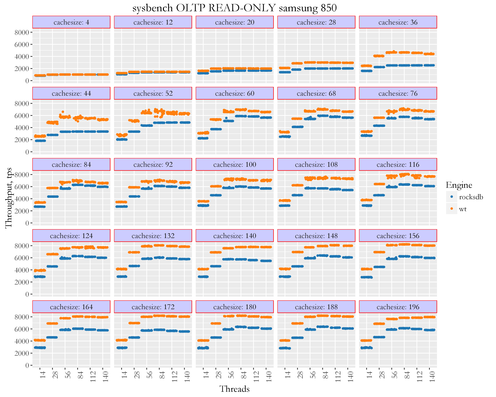
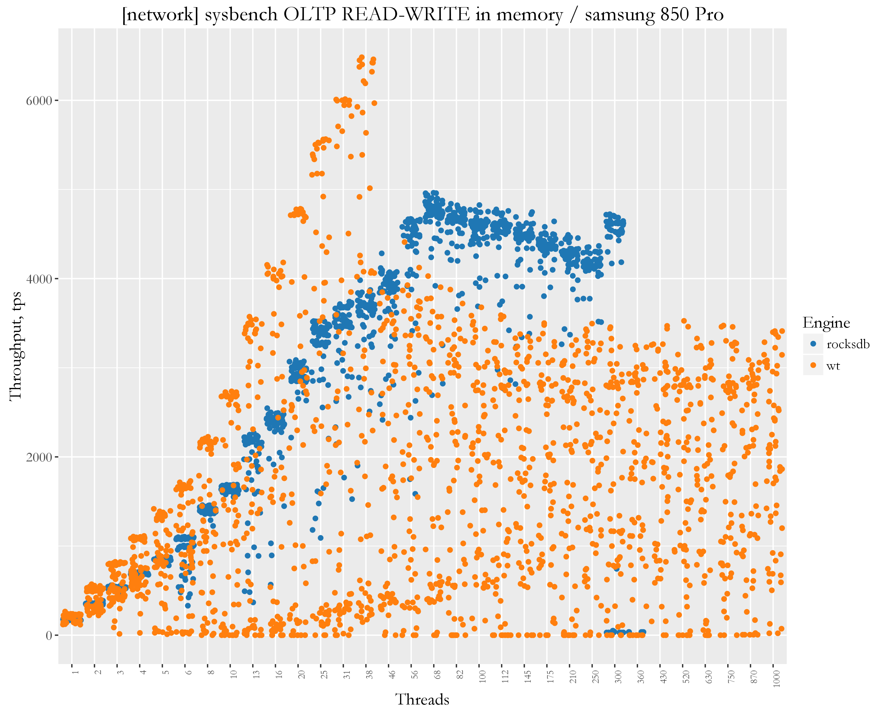
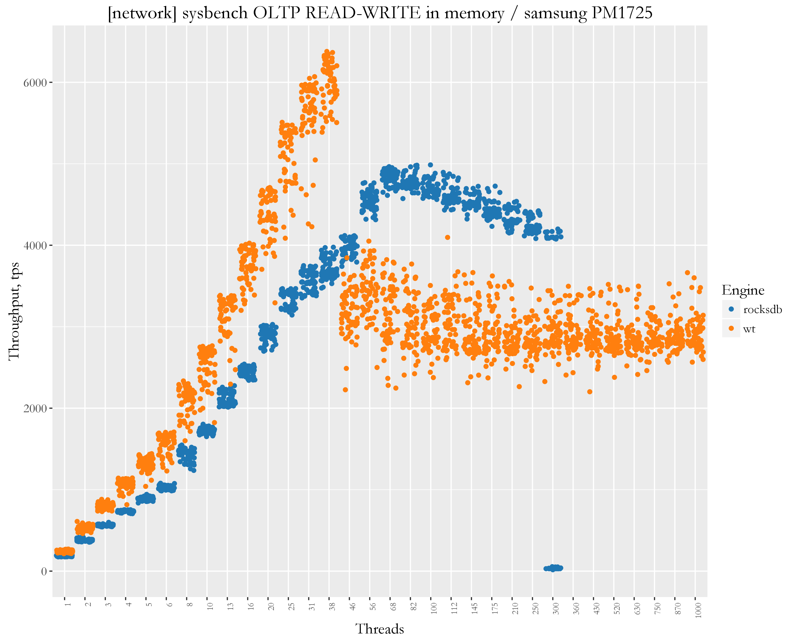
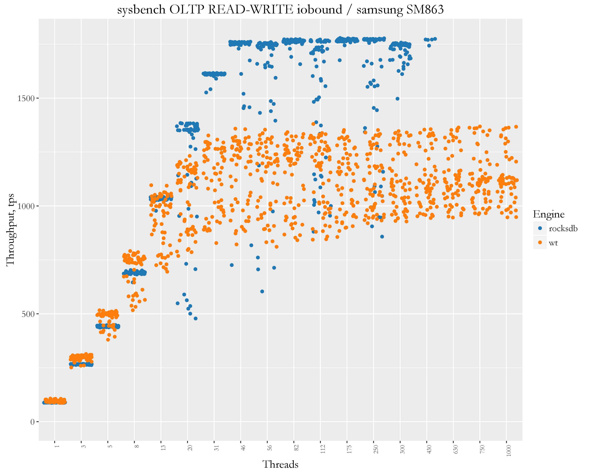

Percona Server for MongoDB 3.2
==============================

Setup
-----

-   Client (sysbench-mongodb) and server are on different servers, connected via 10Gb network.
-   CPU: 56 logical CPU threads servers Intel(R) Xeon(R) CPU E5-2683 v3 @ 2.00GHz
-   sysbench 8 tables x 60mln rows, uniform distribution
-   OS: Ubuntu 16.04 (Xenial Xerus)
-   Kernel 4.4.0-21-generic
-   Storage devices
-   Samsung SM863 SATA SSD, single device, with ext4 filesystem
-   Samsung 850 PRO SATA SSD, single device, with ext4 filesystem
-   Samsung PM 1725 NVMe SSD, single device

Results
=======

=============

Read-only
=========

RO, cachesize vary
------------------

### Samsung 850

RO, threads vary
----------------

### Samsung 850

RO, cachesize vary
------------------

### Samsung 863

RO, Threads 1-1000 in memory (cachesize 200GB)
----------------------------------------------

### Samsung 863

Read-Writes
===========

RW, cachesize vary
------------------

### Samsung 850

 

RW, cachesize vary
------------------

### Samsung 863

 

Read-Write, threads
===================

RW, Threads 1-1000 in memory (cachesize 200GB)
----------------------------------------------

### Samsung 863

RW, Threads 1-1000 io bound (cachesize 20GB)
--------------------------------------------

### Samsung 863

 

### RW, Threads 112 io bound (cachesize 20GB)

-   Samsung 863

RW, Threads 1-1000 in memory (cachesize 200GB)
----------------------------------------------

### Samsung 850

RW, Threads 1-300 io-bound (cachesize 20GB)
-------------------------------------------

### Samsung 850

RW, Threads 1-1000 in memory (cachesize 200GB)
----------------------------------------------

### Samsung PM1725

RW, Threads 1-300 io-bound (cachesize 20GB)
-------------------------------------------

### Samsung pm1725

 

RW, Threads 1-1000 in memory (cachesize 200GB)
----------------------------------------------

### Samsung storage

RW, Threads 1-1000 iobound (cachesize 20GB)
-------------------------------------------

### Samsung storage

-   Charts examples

\*RO, memory scale

\*RocksDB, compession
